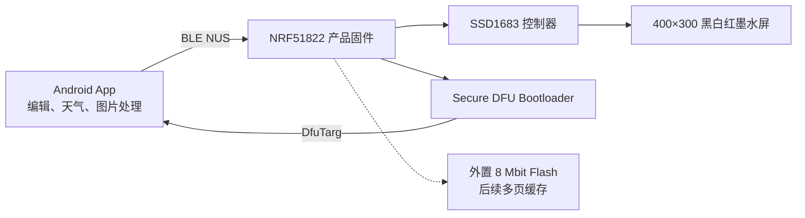

# InkDesk NRF51822 项目索引

InkDesk 是一块由手机编辑、通过 BLE 发送、在 400×300 黑白红墨水屏上长期显示的低打扰桌面信息牌。

## 当前结论

- 硬件基础：NRF51822-QFAC-R、S130、SSD1683、400×300 三色墨水屏、外置 8 Mbit Flash。
- 产品固件：v1.0.0 已完成编译和打包，应用版本号为 6，应用大小 24,524 字节。
- 已实现：BLE NUS、双平面传图、清屏、时钟、时间同步、设备信息、运行状态、BUSY 保护、自检和 Secure DFU。
- 已验证：源码干净构建、内存布局、DFU 包签名元数据、Bootloader settings CRC；2026-08-15 已通过 J-Link App-only 烧录并完成应用区回读哈希一致性验证。
- 运行证据：应用能从 Bootloader 启动，`sd_ble_gap_adv_start()` 返回成功；当前 Windows 主机仍未扫描到 `EPD_Ink`，无线空口和后续协议链路尚未闭环。
- 尚待实板回归：广播可见性、信息查询、时间同步、三色测试图、完整传图与 OTA。

## 系统结构

## 知识导航

- [[01_产品定义与范围]]
- [[02_硬件架构与引脚]]
- [[03_固件架构与内存布局]]
- [[04_BLE产品协议]]
- [[05_墨水屏帧缓冲与刷新]]
- [[06_时钟系统]]
- [[07_构建烧录与DFU]]
- [[08_故障排查与最短验证路径]]
- [[09_产品与技术路线图]]
- [[10_交付物与安全边界]]

## 下一次接手时先做

1. 确认屏幕刷新端有 5 V，逻辑电源约为 3.3 V。
2. 用 J-Link 只升级 App 和匹配的 settings，避免无必要的整片擦除。
3. 扫描 `EPD_Ink`，依次执行 `PING → INFO → CAPS → STATUS`。
4. 同步时间，等待 `TIME_OK` 和 `CLK_OK`。
5. 发送 `TEST bands`，确认白、黑、红三段正常。
6. 发送完整 BW/RED 图像，只有收到 `SHOW_OK` 才判定成功。
