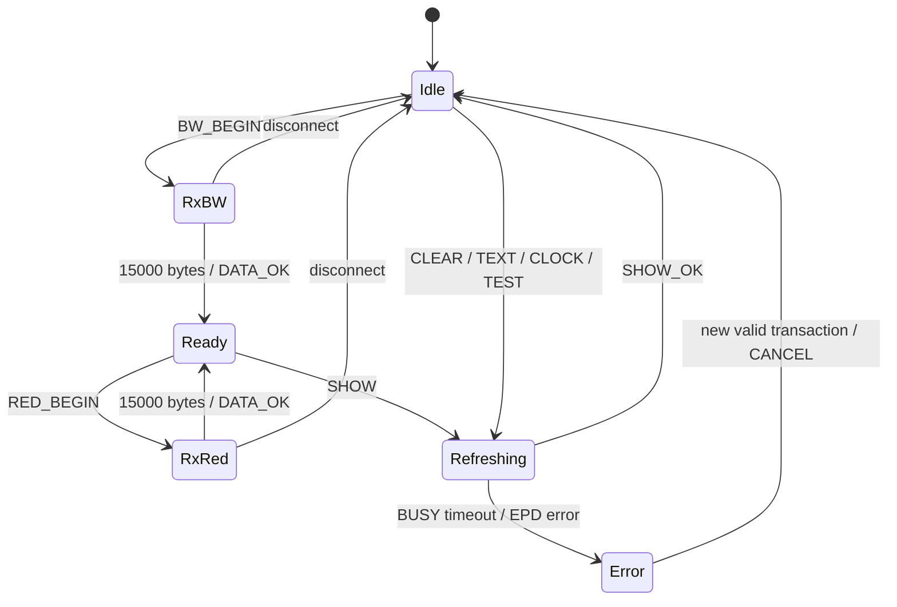

# 固件架构与内存布局

## 启动顺序

1. 初始化墨水屏 GPIO 和 LED。
2. 初始化 App Timer。
3. 启动 S130 BLE 栈，设置 GAP、NUS、广播和连接参数。
4. 先广播 `EPD_Ink`，避免屏幕 BUSY 阻塞 BLE 可见性。
5. 启动 1 秒时钟定时器。
6. 主循环处理显示 Job，然后进入 SoftDevice 低功耗等待。

## 分层

- BLE 层：连接、广播、NUS 收发、超时和重新广播。
- 协议层：命令解析、长度校验、阶段状态和错误码。
- Job 层：把慢速屏幕操作移到主循环，避免在 BLE 事件中执行完整刷新。
- 显示层：SSD1683 初始化、窗口设置、双平面写入和 BUSY 等待。
- 时间层：手机同步时间、日历进位和每 5 分钟刷新。
- Bootloader：独立 Secure DFU，广播名为 `DfuTarg`。

## 状态机

## Flash 布局

| 区域 | 起始地址 | 说明 |
|---|---:|---|
| MBR + S130 | `0x00000000` | BLE SoftDevice 2.0.1 |
| 应用 | `0x0001B000` | 链接长度 `0x1FC00`，结束于 Bootloader 之前 |
| Secure Bootloader | `0x0003AC00` | 安全 DFU |
| Bootloader settings | `0x0003FC00` | 应用版本、大小和 CRC |

最终 v1.0.0 构建：代码 24,408 字节、数据 116 字节、BSS 928 字节；应用镜像共 24,524 字节。

## 并发约束

- `m_job != JOB_NONE` 或 `m_display_busy == true` 时，修改类命令返回 `BUSY`。
- PING、INFO、STATUS、CAPS 可以在刷新期间查询。
- 时钟定时器只在空闲且没有传输时安排刷新，不覆盖正在进行的图像事务。
- BLE 断连会结束未完成的裸图像流并清除平面有效标志。

关联：[[04_BLE产品协议]]、[[07_构建烧录与DFU]]。

