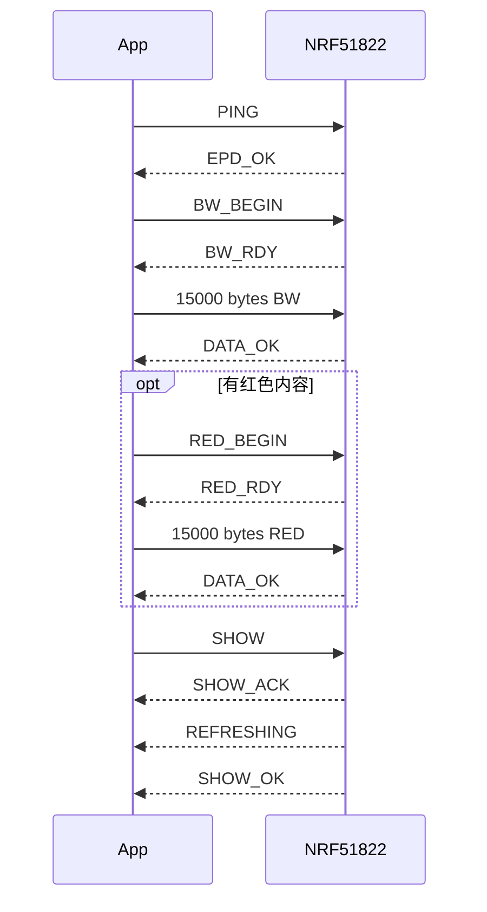

# BLE 产品协议

## 基础参数

- 正常广播名：`EPD_Ink`
- DFU 广播名：`DfuTarg`
- 服务：Nordic UART Service
- RX（手机写设备）：`6e400002-b5a3-f393-e0a9-e50e24dcca9e`
- TX（设备 Notify）：`6e400003-b5a3-f393-e0a9-e50e24dcca9e`
- 默认 ATT 数据长度：20 字节

## 命令表

| CMD | 名称 | 请求 | 成功回复 |
|---:|---|---|---|
| `0x01` | CLEAR | 单字节 | `REFRESHING → CLR_OK` |
| `0x02` | TEXT | `u16be 长度 + ASCII`，最多 240 字节 | `REFRESHING → TXT_OK` |
| `0x03` | BW_BEGIN | 随后 15,000 个裸数据字节 | `BW_RDY → DATA_OK` |
| `0x04` | RED_BEGIN | 随后 15,000 个裸数据字节 | `RED_RDY → DATA_OK` |
| `0x05` | DATA | 保留，v1 裸流不使用 | `NO_IMG` |
| `0x06` | SHOW | BW 已完整 | `SHOW_ACK → REFRESHING → SHOW_OK` |
| `0x07` | PING | 单字节 | `EPD_OK` |
| `0x08` | DFU | 单字节 | `DFU`，随后复位 |
| `0x09` | TIME | `HH MM SS YY MO DD` | `TIME_OK → CLK_OK` |
| `0x0A` | CLOCK | 单字节 | `CLK → CLK_OK` |
| `0x0B` | INFO | 单字节 | `INFO,1.0.0,1,400x300` |
| `0x0C` | STATUS | 单字节 | `ST,<state>,Tn,Bn,Rn,En` |
| `0x0D` | CANCEL | 单字节 | `CANCEL_OK` 或 `CANCEL_BUSY` |
| `0x0E` | TEST | pattern：0 白、1 黑、2 红、3 三色带 | `TEST_ACK → TEST_OK` |
| `0x0F` | CAPS | 单字节 | `CAP,BWR,FULL,5V,NB` |

`CAP,BWR,FULL,5V,NB` 表示：黑白红、只承诺全刷、刷新需要 5 V、不支持电量测量。

## STATUS 格式

示例：`ST,D,T1,B1,R0,E0`

- 状态：`I` 空闲、`W` 收 BW、`R` 收 RED、`D` 数据就绪、`B` 刷新中、`E` 错误。
- `T1`：设备时间有效。
- `B1/R1`：对应平面完整。
- `E0`：最近错误码为 0。

错误码：1 BUSY 超时、2 未知命令、3 数据不完整、4 缺少 BW、5 时间非法、6 测试图非法、7 屏幕错误、8 文本过长。

## 标准传图时序

## App 必须遵守

- 每个阶段等待真实回复，不能依靠固定延时。
- 未收到 `DATA_OK` 不发送下一阶段。
- 未收到 `SHOW_OK` 不标记“已显示”。
- 裸平面传输中不能插入命令；中途取消应断开 BLE。
- Windows/Android GATT 缓存异常时，先断开、关闭蓝牙、重新扫描，不要立即判定固件损坏。

关联：[[03_固件架构与内存布局]]、[[05_墨水屏帧缓冲与刷新]]。

