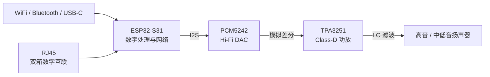

# 数字主动监听音箱项目索引

## 一句话定位

一款面向桌面场景的中端 Hi-Fi 主动监听音箱：接收数字音源，经过数字处理、独立 DAC、Class-D 功放和主动分频后驱动扬声器。

## 当前方案结论

- 数字音频主链路为：数字输入 → 数字处理 → PCM5242 DAC → 模拟差分 → TPA3251 → LC 输出滤波 → 扬声器。
- 产品规划包含 WiFi、Bluetooth、USB-C 数字音频，以及通过 RJ45 实现的双箱数字互联。
- 硬件采用接口板 + 功放板的双板架构，目标是释放天线位置、改善功率区散热并隔离数字与模拟/功率区域。
- 第一代暂定使用 ESP32-S31-WROOM，通过分板安排天线位置；裸芯片 + RF 匹配 + IPEX/FPC 天线属于后续方案。
- 第一版固件已切换到原理图对应的 `hanako_esp32s31_hifi` 自定义板卡：Classic A2DP Sink（SBC/AAC）、AVRCP、BLE GATT、PCM5242、TPA3251 电源/保护和面板编码器均已接入并构建通过；尚未完成实物烧录和电气验证。
- 原始资料中的功率、电源、LC 和器件数值均属于设计输入或候选初值，尚未视为实测结论。

## 系统结构

## 硬件分板

- 接口板：ESP32-S31-WROOM、USB-C、RJ45、LAN8720A、网络通信和低压电源。
- 功放板：PCM5242、TPA3251、PVDD 电源、LC 滤波、喇叭接口和散热结构。
- 两板通过三明治连接器传递电源、I2S、I2C、复位、故障和辅助电源信号。

## 知识导航

- [[01_产品定位与功能]]
- [[02_双板架构与ESP32]]
- [[03_数字音频链路与PCM5242]]
- [[04_TPA3251功放与电源]]
- [[05_PCB布局与三明治连接器]]
- [[06_BOM优化与产品定位]]
- [[07_验证计划与开发路线]]
- [[08_待确认参数与风险]]
- [[09_扬声器首轮采购候选]]
- [[对话知识/2026/2026-08/2026-08-28-ESP32-S31音响原理图定制固件]]

## 当前优先级

1. 确认实物模组完整后缀是 N8R16V、N16R16V 还是 N32R16V；当前固件暂按 N16R16V 配置。
2. 根据扬声器阻抗、灵敏度和分频目标复核 TPA3251 功率配置。
3. 修改原理图中 `AMP_RESET_N` 同时连接 IO4 与 GPIO20 的管脚互短，并复核编码器 GPIO37 启动绑带风险。
4. 先做电源、热、EMI 和 WiFi/双箱通信的工程样机验证，再冻结 BOM。
